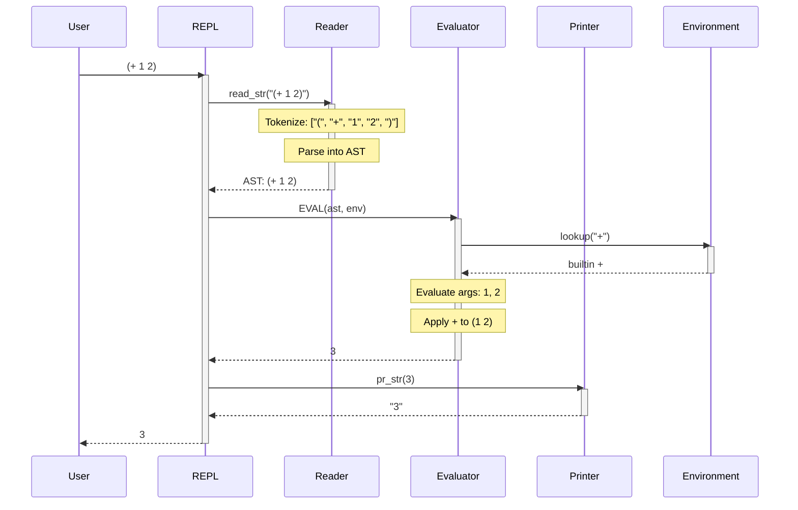

# MAL Ruby Minimal

[](https://www.ruby-lang.org/)
[](https://github.com/kanaka/mal)
[](https://opensource.org/licenses/MIT)
[](https://mitpress.mit.edu/sites/default/files/sicp/index.html)
[](https://github.com/aygp-dr/mal-ruby-minimal)

A minimal implementation of MAL (Make a Lisp) in Ruby using only 13 AST node types.

## Implementation Architecture



## Implementation Steps

```mermaid
graph LR
    subgraph "Core Foundation"
        S0[Step 0<br/>Basic REPL]
        S1[Step 1<br/>Parse/Print]
        S2[Step 2<br/>Evaluation]
        S3[Step 3<br/>Variables]
    end
    
    subgraph "Language Features"
        S4[Step 4<br/>Functions]
        S5[Step 5<br/>TCO]
        S6[Step 6<br/>Files]
        S7[Step 7<br/>Macros]
    end
    
    subgraph "Advanced"
        S8[Step 8<br/>Macros+]
        S9[Step 9<br/>Try/Catch]
        SA[Step A<br/>Self-Host]
    end
    
    S0 --> S1 --> S2 --> S3
    S3 --> S4 --> S5 --> S6 --> S7
    S7 --> S8 --> S9 --> SA
    
    style S0 fill:#90EE90
    style S1 fill:#90EE90
    style S2 fill:#90EE90
    style S3 fill:#90EE90
    style S4 fill:#90EE90
    style S5 fill:#90EE90
    style S6 fill:#90EE90
    style S7 fill:#FFD700
    style S8 fill:#FFB6C1
    style S9 fill:#FFB6C1
    style SA fill:#FFB6C1
```



*Green: Complete | Yellow: In Progress | Pink: Planned*

> **Note**: This is an experimental exploration into minimal language implementation. It demonstrates how a complete Lisp interpreter can be built without using Ruby's built-in arrays, hashes, or blocks - everything is constructed from cons cells.

## Overview

This project implements a complete Lisp interpreter following the [Make-a-Lisp (MAL)](https://github.com/kanaka/mal) process, but with extreme minimalism constraints:

### Constraints
- **No Ruby arrays** - Lists built from cons cells instead
- **No Ruby hashes** - Environments use association lists  
- **No Ruby blocks** - No `each`, `map`, or `{...}` blocks
- **Only 13 AST node types** - Based on Ruby Essence research

### What You'll Learn
1. **Fundamental CS Concepts**
   - How interpreters work internally
   - Data structures from first principles
   - The power of cons cells and recursion
   
2. **Language Design**
   - Parsing and tokenization
   - Environment management
   - Special forms vs functions
   - Tail call optimization

3. **Lisp Philosophy**  
   - Code as data (homoiconicity)
   - Everything is an expression
   - The beauty of S-expressions

### Features Implemented
- **Parser**: Tokenizer and recursive descent parser for S-expressions
- **Data Types**: Numbers, strings, symbols, lists, functions
- **Special Forms**: `def!`, `let*`, `if`, `fn*`, `do`, `quote`, `quasiquote`
- **Functions**: First-class functions with lexical closures
- **TCO**: Tail call optimization prevents stack overflow
- **I/O**: File loading and basic output
- **Metaprogramming**: Quote and quasiquote for code manipulation

## Running the REPL

```bash
ruby mal_minimal.rb
```

Or make it executable:
```bash
chmod +x mal_minimal.rb
./mal_minimal.rb
```

## Example Session

### Basic Arithmetic
```lisp
> (+ 1 2)
3

> (* 3 (+ 4 5))
27
```

### Variables and Definitions
```lisp
> (def! x 42)
42

> x
42

> (def! y (+ x 8))
50
```

### Functions
```lisp
; Define a simple function
> (def! inc (fn* (n) (+ n 1)))
#<function>

> (inc 5)
6

; Functions are first-class values
> (def! apply-twice (fn* (f x) (f (f x))))
#<function>

> (apply-twice inc 5)
7
```

### Recursion
```lisp
; Factorial with recursion
> (def! fact (fn* (n) 
    (if (= n 0) 
        1 
        (* n (fact (- n 1))))))
#<function>

> (fact 5)
120

; Tail-recursive sum (won't blow the stack!)
> (def! sum-to (fn* (n acc) 
    (if (= n 0) 
        acc 
        (sum-to (- n 1) (+ n acc)))))
#<function>

> (sum-to 10000 0)  ; Sum 1 to 10000
50005000
```

### List Processing
```lisp
; Manual list construction with cons
> (cons 1 (cons 2 (cons 3 nil)))
(1 2 3)

; Using the list function
> (list 1 2 3)
(1 2 3)

; List operations
> (car (list 1 2 3))
1

> (cdr (list 1 2 3))
(2 3)

; Define map from scratch!
> (def! map (fn* (f lst) 
    (if (empty? lst) 
        nil 
        (cons (f (car lst)) 
              (map f (cdr lst))))))
#<function>

> (map inc (list 1 2 3))
(2 3 4)
```

### Let Bindings and Scope
```lisp
> (let* (a 10 
         b 20) 
    (+ a b))
30

; Lexical scoping
> (def! x 100)
100

> (let* (x 42) x)  ; Inner x shadows outer
42

> x  ; Outer x unchanged
100
```

### Code as Data (Quote)
```lisp
; Quote prevents evaluation
> (quote (+ 1 2))
(+ 1 2)

; Shorthand with '
> '(a b c)
(a b c)

; Quasiquote allows selective evaluation
> (def! x 10)
10

> `(a b ~x d)  ; ~ is unquote
(a b 10 d)

> `(1 2 ~@(list 3 4) 5)  ; ~@ is splice-unquote
(1 2 3 4 5)
```

## Built-in Functions

- Arithmetic: `+`, `-`, `*`, `/`
- Comparison: `=`, `<`, `>`
- List operations: `list`, `car`, `cdr`, `cons`, `null?`
- I/O: `print`

## Special Forms

- `def` - Define a variable
- `if` - Conditional expression
- `fn` - Create a function
- `quote` - Return expression unevaluated
- `do` - Evaluate multiple expressions

## Implementation Details

The implementation uses only basic Ruby constructs:
- Object instances for pairs, symbols, functions, and environments
- String eval for defining methods on objects
- No arrays or hashes - everything is built from cons cells
- Association lists for environment bindings

## Project Status

This is an **experimental exploration** that investigates:
- How minimal can a language implementation be?
- Can we build everything from just cons cells?
- What are the trade-offs of extreme minimalism?
- How do the 13 essential Ruby AST nodes map to interpreter construction?

## Research Context

This implementation is part of research into:
1. The Ruby Essence project's finding that 13 AST nodes cover 81% of Ruby code
2. SICP-style minimalist language construction
3. The MAL (Make a Lisp) step-by-step approach to building interpreters

## License

MIT