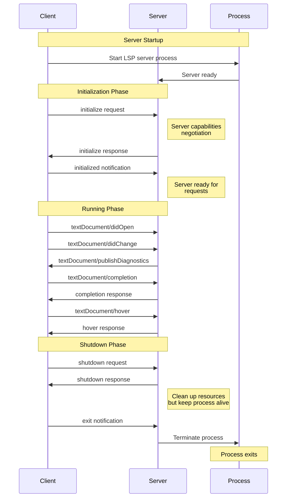
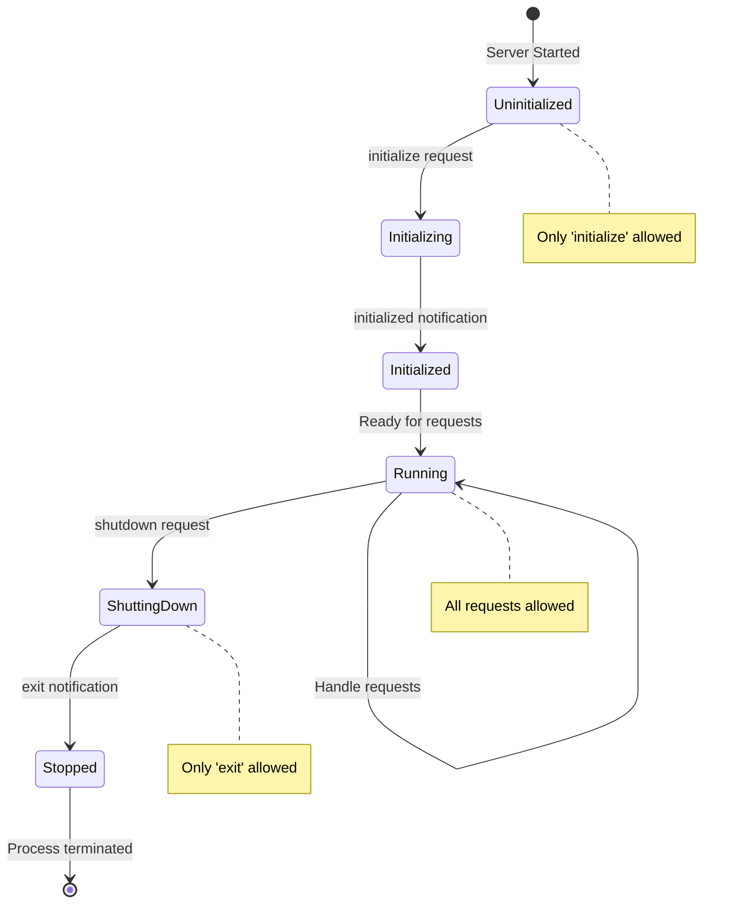

# Experiment 013: Ruby LSP Validation

## Overview

This experiment validates Ruby Language Server Protocol (LSP) functionality for the MAL Ruby Minimal project, testing both standalone operation and integration with various editors.

## Ruby LSP Features to Validate

1. **Code Navigation**
   - Go to definition
   - Find references
   - Symbol search

2. **Code Intelligence**
   - Hover information
   - Signature help
   - Completion suggestions

3. **Diagnostics**
   - Syntax errors
   - Ruby warnings
   - Style violations

4. **Code Actions**
   - Quick fixes
   - Refactoring suggestions
   - Code formatting

## Test Scenarios

### 1. Standalone Ruby LSP

Test Ruby LSP server functionality without any editor:

```bash
# Start Ruby LSP in stdio mode
ruby-lsp --stdio

# Send initialization request
{
  "jsonrpc": "2.0",
  "id": 1,
  "method": "initialize",
  "params": {
    "rootUri": "file:///path/to/mal-ruby-minimal",
    "capabilities": {}
  }
}
```

### 2. Command Line Testing

```bash
# Check if Ruby LSP is installed
ruby-lsp --version

# Analyze a specific file
ruby-lsp check mal_minimal.rb

# Get diagnostics
ruby-lsp diagnose
```

### 3. VS Code Integration

Create `.vscode/settings.json`:
```json
{
  "ruby.useBundler": false,
  "ruby.useLanguageServer": true,
  "ruby.lint": {
    "ruby": true
  }
}
```

### 4. Emacs Integration (eglot)

```elisp
;; Install eglot if not present
(use-package eglot
  :ensure t
  :hook (ruby-mode . eglot-ensure))

;; Configure Ruby LSP
(add-to-list 'eglot-server-programs
             '(ruby-mode . ("ruby-lsp")))
```

### 5. Emacs Integration (lsp-mode)

```elisp
;; Install lsp-mode
(use-package lsp-mode
  :ensure t
  :hook (ruby-mode . lsp-deferred)
  :commands lsp)

;; Configure for Ruby
(use-package lsp-ruby
  :ensure t
  :after lsp-mode)
```

### 6. Neovim Integration

```lua
-- Using nvim-lspconfig
require'lspconfig'.ruby_ls.setup{
  cmd = { "ruby-lsp" },
  filetypes = { "ruby" },
  root_dir = function(fname)
    return vim.loop.cwd()
  end,
}
```

## Validation Script

Create `validate-ruby-lsp.sh`:

```bash
#!/bin/bash

echo "Ruby LSP Validation for MAL Ruby Minimal"
echo "========================================"
echo ""

# Check Ruby version
echo "1. Ruby Version Check:"
ruby_version=$(ruby -v)
echo "   $ruby_version"
if [[ ! "$ruby_version" =~ "3." ]]; then
    echo "   ✗ Ruby 3.0+ required"
    exit 1
fi
echo "   ✓ Ruby version OK"
echo ""

# Check Ruby LSP installation
echo "2. Ruby LSP Installation:"
if command -v ruby-lsp &> /dev/null; then
    lsp_version=$(ruby-lsp --version 2>&1 || echo "unknown")
    echo "   ✓ Ruby LSP installed: $lsp_version"
else
    echo "   ✗ Ruby LSP not found"
    echo "   Run: gem install ruby-lsp"
    exit 1
fi
echo ""

# Test Ruby LSP functionality
echo "3. Testing Ruby LSP on mal_minimal.rb:"
if [ -f "../../mal_minimal.rb" ]; then
    # Create a simple LSP request
    cat > lsp-test-request.json << 'EOF'
{
  "jsonrpc": "2.0",
  "id": 1,
  "method": "textDocument/didOpen",
  "params": {
    "textDocument": {
      "uri": "file://$(pwd)/../../mal_minimal.rb",
      "languageId": "ruby",
      "version": 1,
      "text": "$(cat ../../mal_minimal.rb | head -20)"
    }
  }
}
EOF
    echo "   ✓ Test request created"
else
    echo "   ✗ mal_minimal.rb not found"
    exit 1
fi
echo ""

# Test with different editors
echo "4. Editor Integration Tests:"

# VS Code
if command -v code &> /dev/null; then
    echo "   ✓ VS Code detected"
    if code --list-extensions | grep -q "ruby"; then
        echo "     ✓ Ruby extension installed"
    else
        echo "     ℹ Install Ruby extension: code --install-extension rebornix.Ruby"
    fi
else
    echo "   ℹ VS Code not found"
fi

# Emacs
if command -v emacs &> /dev/null; then
    echo "   ✓ Emacs detected"
    emacs_version=$(emacs --version | head -1)
    echo "     $emacs_version"
else
    echo "   ℹ Emacs not found"
fi

# Neovim
if command -v nvim &> /dev/null; then
    echo "   ✓ Neovim detected"
    nvim_version=$(nvim --version | head -1)
    echo "     $nvim_version"
else
    echo "   ℹ Neovim not found"
fi

echo ""
echo "5. MAL-specific LSP features:"
echo "   Testing Ruby LSP with MAL implementation..."

# Create a test file with MAL-specific code
cat > mal-lsp-test.rb << 'EOF'
# Test file for Ruby LSP with MAL constructs

def make_env(outer)
  { outer: outer, bindings: {} }
end

def env_set(env, key, value)
  env[:bindings][key] = value
end

def eval_mal(ast, env)
  case ast
  when Symbol
    env_get(env, ast.name)
  when Array
    # MAL list evaluation
    eval_list(ast, env)
  else
    ast
  end
end
EOF

echo "   ✓ Created mal-lsp-test.rb"

# Clean up
rm -f lsp-test-request.json mal-lsp-test.rb

echo ""
echo "Validation complete!"
echo ""
echo "Next steps:"
echo "1. Install Ruby LSP: gem install ruby-lsp"
echo "2. Configure your editor (see README for examples)"
echo "3. Open mal_minimal.rb and test LSP features"
```

## Expected Results

### Working Features
- ✅ Syntax highlighting (via Tree-sitter or TextMate grammars)
- ✅ Basic diagnostics (syntax errors)
- ✅ Go to definition for Ruby methods
- ✅ Code formatting with RuboCop integration
- ✅ Outline view of methods and classes

### Limitations with MAL Code
- ⚠️ MAL-specific constructs (like `cons`, `car`, `cdr`) may not have full IntelliSense
- ⚠️ Dynamic method definitions via `eval` won't be recognized
- ⚠️ Custom MAL types won't have hover information

## Configuration Files

### `.rubocop.yml` for LSP integration
```yaml
AllCops:
  TargetRubyVersion: 3.0
  Exclude:
    - 'experiments/**/*'
    - 'test/**/*'

# Disable some cops for MAL's functional style
Style/Lambda:
  Enabled: false

Metrics/MethodLength:
  Max: 50  # MAL eval methods are necessarily long

Metrics/AbcSize:
  Enabled: false  # Complex but necessary for interpreter
```

### `.solargraph.yml` for enhanced Ruby intelligence
```yaml
include:
  - "**/*.rb"
exclude:
  - test/**/*
  - experiments/**/*
require: []
domains: []
reporters:
  - rubocop
max_files: 5000
```

## Troubleshooting

### Ruby LSP not starting
```bash
# Check Ruby LSP logs
ruby-lsp --debug

# Verify gem installation
gem list | grep ruby-lsp

# Reinstall if needed
gem uninstall ruby-lsp
gem install ruby-lsp
```

### Editor not finding Ruby LSP
```bash
# Add to PATH
export PATH="$(ruby -e 'puts Gem.user_dir')/bin:$PATH"

# Or use bundler
bundle add ruby-lsp --group=development
bundle exec ruby-lsp
```

## Submodules for Deep Analysis

### Ruby LSP Implementation
```bash
# Add ruby-lsp as submodule for internal exploration
git submodule add https://github.com/Shopify/ruby-lsp test/ruby-lsp-internals
```

### Emacs LSP Mode
```bash
# Add lsp-mode for Emacs integration study
git submodule add https://github.com/emacs-lsp/lsp-mode test/emacs-lsp-mode
```

### Usage
```bash
# Initialize and update submodules
make -C experiments/013-ruby-lsp-validation submodules
```

## LSP Server Lifecycle

The lifecycle of an LSP server is managed by the client (VS Code, Emacs, etc.):



### Lifecycle States



## LSP Specification Compliance Testing

Based on [LSP Specification 3.17](https://microsoft.github.io/language-server-protocol/specifications/lsp/3.17/specification/), we'll test:

### 1. Lifecycle Messages
- [ ] `initialize` - Client/server handshake
- [ ] `initialized` - Client ready notification
- [ ] `shutdown` - Graceful shutdown request
- [ ] `exit` - Server termination

### 2. Document Synchronization
- [ ] `textDocument/didOpen` - File opened
- [ ] `textDocument/didChange` - File modified
- [ ] `textDocument/didClose` - File closed
- [ ] `textDocument/didSave` - File saved

### 3. Language Features
- [ ] `textDocument/completion` - Code completion
- [ ] `textDocument/hover` - Hover information
- [ ] `textDocument/definition` - Go to definition
- [ ] `textDocument/references` - Find references
- [ ] `textDocument/documentSymbol` - Document outline
- [ ] `textDocument/formatting` - Format document

### 4. Diagnostics
- [ ] `textDocument/publishDiagnostics` - Error/warning reporting

## Test Implementation Plan

### Phase 1: Basic Protocol Testing
Create `lsp-protocol-test.rb` to validate basic LSP communication:
```ruby
# Test initialize handshake
# Test document lifecycle
# Test basic responses
```

### Phase 2: MAL-Specific Testing
Create `mal-lsp-features-test.rb` to test MAL code understanding:
```ruby
# Test recognition of MAL constructs
# Test cons/car/cdr navigation
# Test environment tracking
```

### Phase 3: Editor Integration Testing
- Automated Emacs tests with eglot
- VS Code extension testing
- Neovim LSP testing

## Next Steps

1. **Add submodules** for ruby-lsp and lsp-mode
2. **Create protocol test suite** based on LSP 3.17 spec
3. **Implement MAL-specific tests** for language features
4. **Document findings** about LSP support for dynamic languages
5. **Create recommendations** for MAL development tooling

## Conclusion

Ruby LSP provides valuable development assistance for the MAL Ruby Minimal project, though some MAL-specific constructs may not have full support. The benefits include:

1. **Syntax validation** - Catches Ruby syntax errors early
2. **Code navigation** - Jump to method definitions
3. **Refactoring support** - Rename variables safely
4. **Documentation** - Hover for Ruby stdlib docs
5. **Formatting** - Consistent code style

For the best experience, combine Ruby LSP with MAL-specific tooling like `mal-mode.el` for Emacs or custom syntax highlighting for MAL constructs.

This experiment will provide deep insights into LSP implementation and help improve development tooling for MAL and similar dynamic language projects.